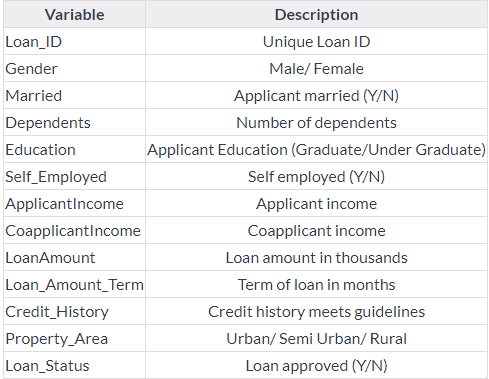

# Bank-Loan-Prediction
Logistic Regression, Decision Tree, Random Forest, XGBoost Algorithm  used  in this project.

# 1.Loading Packages
# 2.Data
For this practice problem, we have been given three CSV files: train, test.

* Train file will be used for training the model, i.e our model will learn from this file. It contains all independent variables and the target variable.
* Test file contains all independent variables, but not the target variables. We will apply the model to predict the target variable for test data.
# 3.Understanding The Data

